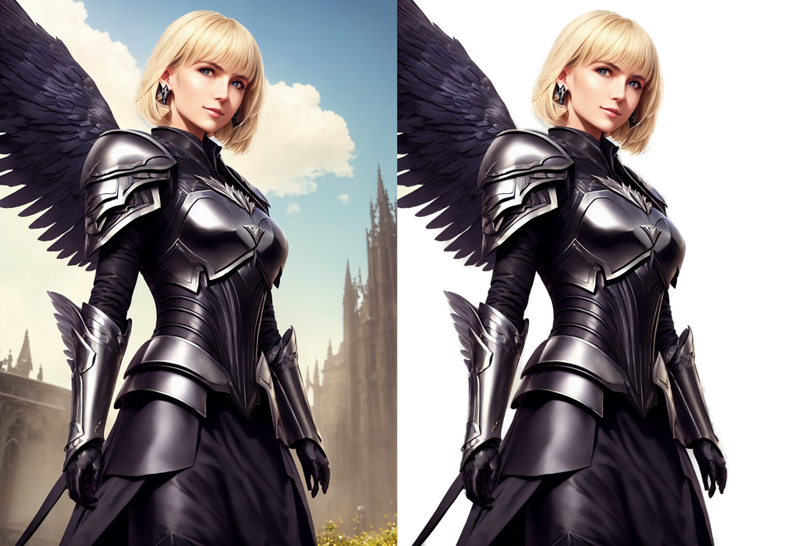

# sd-webui-rembg

Fork from [stable-diffusion-webui-rembg](https://github.com/AUTOMATIC1111/stable-diffusion-webui-rembg), **But add API Support**.

## Installation

Choose one of the following methods, Need to use webui with extension support <sup>(Versions after 2023)</sup>

#### Method 1

Use the `Install from URL` provided by webui to install

Click in order <kbd>Extensions</kbd> - <kbd>Install from URL</kbd>

Then fill in the first text box with `https://github.com/hicoldcat/sd-webui-rembg.git`, click the <kbd>Install</kbd> button.


After that, switch to the <kbd>Installed</kbd> panel and click the <kbd>Apply and restart UI</kbd> button.


#### Method 2

Clone to your extension directory manually.

```bash
git clone https://github.com/hicoldcat/sd-webui-rembg.git extensions/sd-webui-rembg
```

## API Support

### API Usage

We have added an API endpoint to allow for automated workflows.

The API utilizes both Segment Anything and GroundingDINO to return masks of all instances of whatever object is specified in the text prompt.

This is an extension of the existing [Stable Diffusion Web UI API](https://github.com/AUTOMATIC1111/stable-diffusion-webui/wiki/API).

There are 2 endpoints exposed
- GET sam-webui/heartbeat
- POST /sam-webui/image-mask

The heartbeat endpoint can be used to ensure that the API is up.

The image-mask endpoint accepts a payload that includes your base64-encoded image.

Below is an example of how to interface with the API using requests.

### API Example

```
import base64
import requests
from PIL import Image
from io import BytesIO
url = "http://127.0.0.1:7860/sam-webui/image-mask"
def image_to_base64(img_path: str) -> str:
    with open(img_path, "rb") as img_file:
        img_base64 = base64.b64encode(img_file.read()).decode()
    return img_base64
payload = {
    "image": image_to_base64("IMAGE_FILE_PATH"),
    "prompt": "TEXT PROMPT",
    "box_threshold": 0.3,
    "padding": 30 #Optional param to pad masks
}
res = requests.post(url, json=payload)
for dct in res.json():
    image_data = base64.b64decode(dct['image'])
    image = Image.open(BytesIO(image_data))
    image.show()
```


## Rembg

Extension for [webui](https://github.com/AUTOMATIC1111/stable-diffusion-webui). Removes backgrounds from pictures.



Find the UI for rembg in the Extras tab after installing the extension.

# Credits

* rembg library that does all the work: https://github.com/danielgatis/rembg
